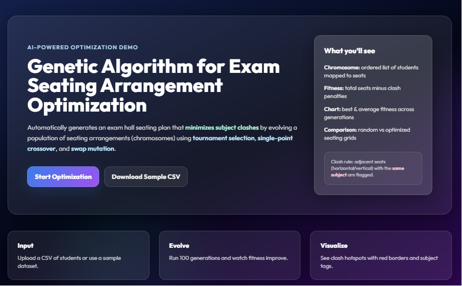
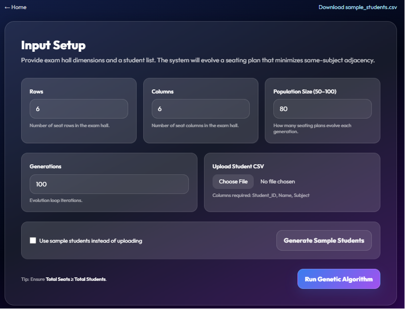
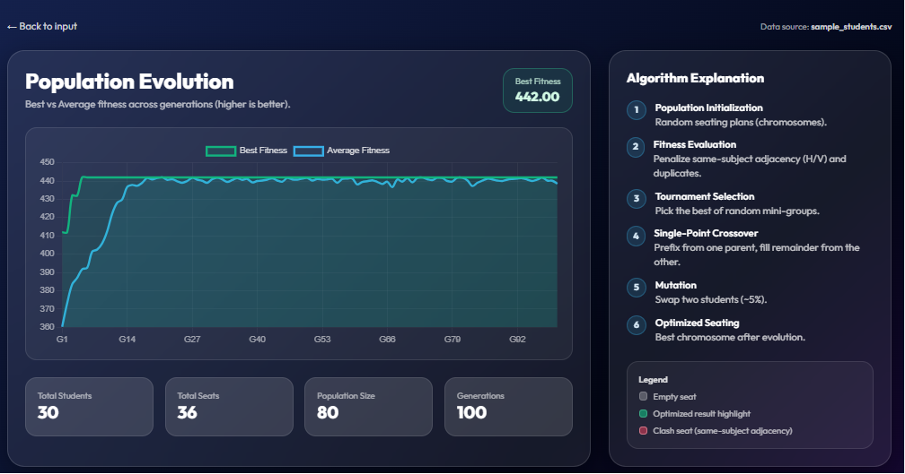
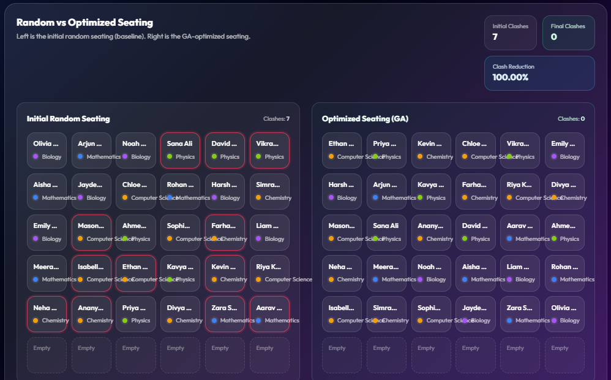

🧬 Exam Seating Arrangement Using Genetic Algorithm

An AI-powered web application that uses a **Genetic Algorithm (GA)** to generate optimized exam seating arrangements. The system minimizes same-subject adjacency, reducing the chances of cheating while efficiently utilizing available seats.
✨ Features

📄 Upload student data using CSV
🪑 Custom exam hall dimensions
⚙️ Adjustable population size & generations
🧬 Tournament Selection, Single-Point Crossover & Mutation
📈 Fitness evolution graph
🔍 Random vs Optimized seating comparison
🚨 Clash detection & reduction statistics
📥 Sample dataset support

📸 Screenshots

🏠 Home Page

⚙️ Input Setup

📈 Population Evolution

🪑 Random vs Optimized Seating

⚙️ Tech Stack

Frontend: HTML, CSS, JavaScript
Backend: Python
Algorithm: Genetic Algorithm
Deployment: Vercel

🚀 How It Works

1. Upload a student CSV or use the sample dataset.
2. Configure hall dimensions and GA parameters.
3. Run the Genetic Algorithm.
4. View the optimized seating plan, fitness graph, and clash reduction statistics.

🎯 Applications

- Schools & Colleges
- Competitive Examinations
- Universities
- Training & Certification Centers

✅ Advantages

- Reduces manual effort
- Minimizes subject clashes
- Fast and scalable
- Easy-to-use interface
- Visual optimization results
## 📌 Conclusion

This project demonstrates the practical use of **Genetic Algorithms** for solving the exam seating arrangement problem by automatically generating optimized seating plans with minimal conflicts.
